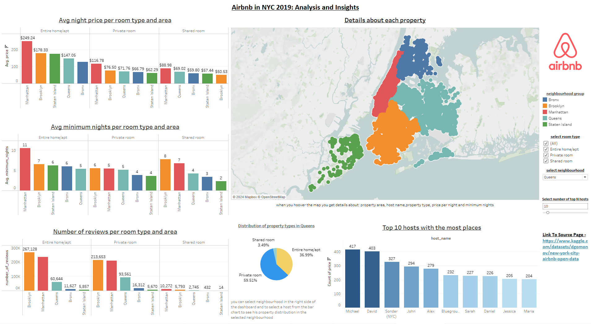

# Airbnb in NYC 2019 - Analysis and Insights 🏠

## Project Overview
This project focuses on analyzing Airbnb listings in New York City for the year 2019. Using a Tableau dashboard, the project provides insights into:

- Average nightly prices across different neighborhoods and room types
- Minimum night stay requirements
- The number of reviews per room type
- Trends across room types and neighborhoods

Interactive filters allow users to explore these trends dynamically.

## Key Insights
1. Pricing by Room Type and Area
The average night price varies significantly by room type and areas.
 
- Most Expensive: Entire homes/apartments are consistently the most expensive, with Manhattan leading at the highest average price.
- Most Affordable: Shared rooms in Staten Island and the Bronx offer the most budget-friendly options, providing clear affordability for travelers on a budget.

2. Minimum Night Stays Requirements
Minimum stay requirements also vary by room type and area.

- Entire homes/apartments typically have higher minimum night requirements, indicating they might be targeted more for longer stays. 
- Staten Island generally has lower minimum night requirements, potentially making it more appealing for shorter stays.
- Manhattan has a consistent high stay requirement across room types, which could indicate a standardized policy by hosts in the area.

3. Review Volume
The number of reviews is an indicator of popularity and booking frequency.

- High Engagement: Entire homes/apartments, particularly in Manhattan and Brooklyn, have significantly higher review counts, reflecting greater occupancy and demand. This can suggest better satisfaction or more frequent bookings in these areas.
- Low Engagement: Areas like Staten Island have far fewer reviews, indicating lower booking rates or market visibility.

4. Geographical Distribution
The map highlights dense concentrations of Airbnb listings in Manhattan and Brooklyn, suggesting higher tourist demand and rental activity in these areas.

5. Top Hosts
Host Concentration: A small number of hosts manage a large number of listings, as indicated by the "Top 10 hosts with the most places" chart. This might suggest the presence of professional hosts or rental businesses dominating the market.

Strategic Recommendations:

For Travelers: 
- This dashboard offers a valuable tool for travelers looking to find accommodations that fit their budget and preferences in terms of room type and location.
- For example: If you're on a budget, consider staying in areas like Staten Island or the Bronx for budget-friendly accommodations.

For Hosts/Investors: 
- Insights from the dashboard can help hosts or real estate investors make informed decisions about where to purchase properties to list on Airbnb, focusing on areas with high demand and profitability. 
- For example: Focus on high-demand areas like Manhattan and Brooklyn for greater profitability. Alternatively, explore opportunities in underserved markets such as Staten Island, where lower property prices may offer higher long-term returns.

## Tools & Technologies
- **Tableau**: For data visualization
- **Data Source**: [Inside Airbnb]([http://insideairbnb.com/get-the-data.html](https://www.kaggle.com/datasets/dgomonov/new-york-city-airbnb-open-data))

## How to Use
1. Download the `.twbx` file from this repository.
2. Open the file in Tableau Public or Tableau Desktop to explore the dashboard.

## Dashboard Preview

